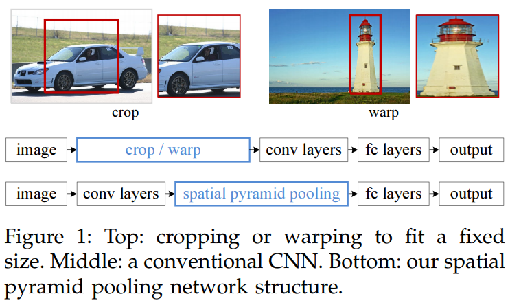
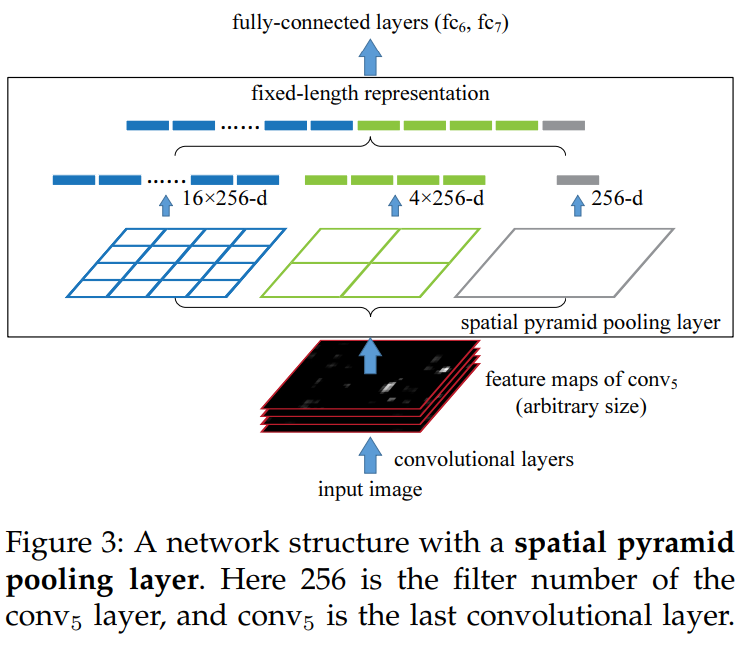
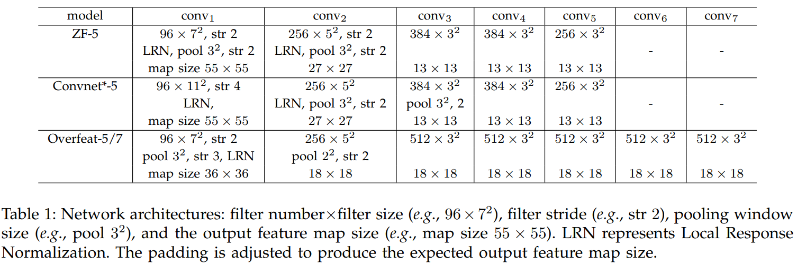
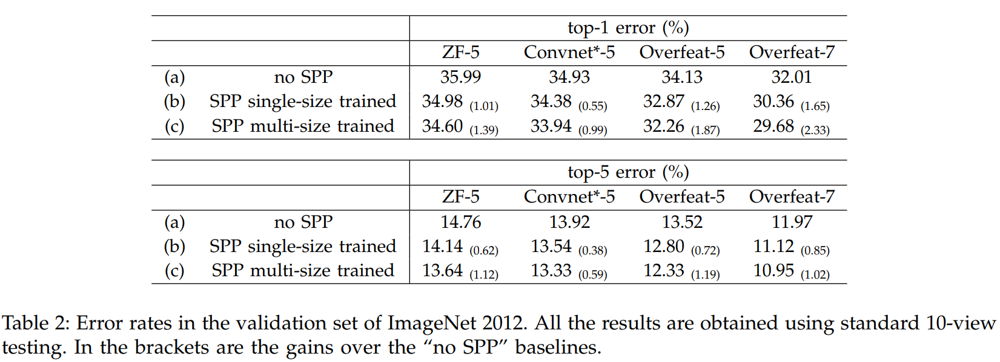
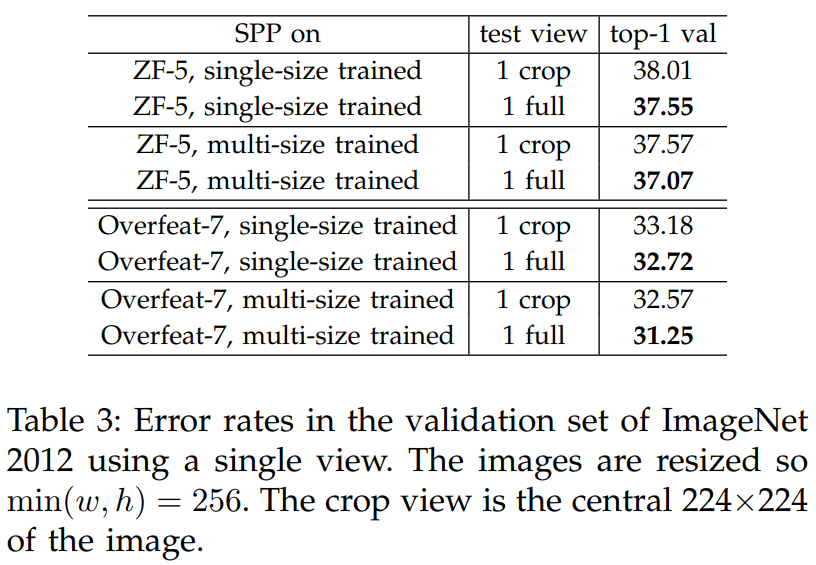

# SPP-Net

## Dataset
```
http://www.robots.ox.ac.uk/~vgg/data/flowers/102/
1. Dataset images ----> 102flowers.tgz
2. The image labels ----> imagelabels.mat
3. The data splits ----> setid.mat
```

## Train
#### Single-size training
```
$ python single.py

image size: [(original_h,original_w)]
BATCH=1
EPOCH=20
====> accuracy ≈ 60% So Bad!!! 
```

#### Multi-size training
```
$ python multi.py

image size: [(350,350), (400,400), (450,450), (500,500)]
BATCH=32
EPOCH=10
====> accuracy ≈ 70% So Bad!!! 
```

#### TensorBoardX
```
$ tensorboard --logdir='./log_single' --port=6006
or
$ tensorboard --logdir='./log_multi' --port=6006

Then, open http://localhost:6006/ on your web browser.
```

## Infer
```
$ python infer.py

model_path = './data/xxxx'
iamge_path = './data/xxxx'
```

## Paper
[《Spatial Pyramid Pooling in Deep Convolutional Networks for Visual Recognition》](https://arxiv.org/pdf/1406.4729.pdf)




```
layer = (13*13)
level = [3,2,1]

pool 3x3
window size = ceil[13/3] = 5
stride size = floor[13/3] = 4

pool 2x2
window size = ceil[13/3] = 7
stride size = floor[13/3] = 6

pool 1x1
window size = ceil[13/3] = 13
stride size = floor[13/3] = 13
```






